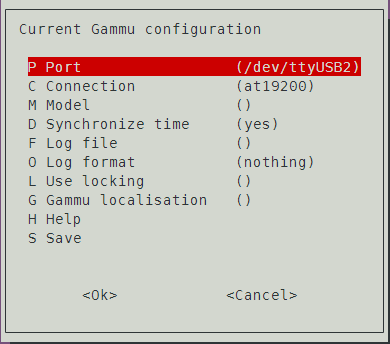

# 树莓派+4G模块 实现短信转发

最初是想用[Air780E+ESP32C3](https://www.chenxublog.com/2022/10/28/19-9-sms-forwarding-air780e-esp32c3.html)的方案实现的,但手里不用的SIM卡是电信的,Air780E不支持电信,正好手里有个吃灰很久的树莓派3B+,采购了一块移远EC600N作为4G模块.

<!-- more -->
## 使用场景
电话卡太多了,一般人手常用的至少两张,某些单位再塞一张工作卡,开宽带再来一张卡,很多卡绑着很多东西又没法注销,办个低消套餐使用短信转发设备,将收到的短信转发至自己常用的IM.

## 方案优劣
1. 直接找台不用的安卓手机,安装短信转发软件,如[SmsForwarder](https://github.com/pppscn/SmsForwarder)  ,但是手机得24小时充电挂着,担心电池鼓包,但是是最简单的方案
2. 4G模块+单板机,本文采用这种方法,折腾爱好者专用  
材料清单:

    * 移远EC600N(算上邮费95)
    * 树莓派3B+(2018年买的,358)

## 步骤
1. 树莓派随意安装喜欢的系统
2. 安装软件[Gammu](https://wammu.eu/)  
```sudo apt install gammu```
3. SIM卡插入EC600N,插入树莓派
4. 查看是否检测到设备  
```ls /dev/ttyUSB*```  
  
可以看到有3个串口,其中一个对应4G模块的短信串口
5. 检测4G模块是否识别SIM卡,可能会出现的配置文件存在的说明,直接YES即可  
```sudo gammu-config```  

Port项需尝试3个串口,大概率是最后一个  
Connection改成**at19200**  
保存后使用命令  
```sudo gammu --identify```  
有IMEI,SIM之类的信息说明已经识别到了,可以进行下一步了.
6. 发送短信测试  
```echo "test sms from pi" | sudo gammu sendsms TEXT 186XXXXXXXX```
7. 安装Gammu相关插件,以及配置,修改配置文件中的**port**和**connection**,内容同上,其中`RunOnReceive`配置文收到短信后,需要执行的程序,`logfile`(可选)修改路径,方便查询问题,配置完后,重启`gammu-smsd`  
```
sudo apt-get install gammu-smsd
```  
```
sudo vim /etc/gammu-smsdrc
```  
```
# Configuration file for Gammu SMS Daemon

# Gammu library configuration, see gammurc(5)
[gammu]
# Please configure this!
port = /dev/ttyUSB2
connection = at19200
# Debugging
#logformat = textall

# SMSD configuration, see gammu-smsdrc(5)
[smsd]
service = files
RunOnReceive =/usr/bin/python3 /home/pi/sms/smsForward.py
logfile = /home/pi/sms/syslog.log
# Increase for debugging information
debuglevel = 0

# Paths where messages are stored
inboxpath = /var/spool/gammu/inbox/
outboxpath = /var/spool/gammu/outbox/
sentsmspath = /var/spool/gammu/sent/
errorsmspath = /var/spool/gammu/error/
```
```
sudo systemctl restart gammu-smsd
```

## 转发脚本
参考官方的[Processing message text in Python](https://docs.gammu.org/smsd/run.html#processing-message-text-in-python),我这里采用的是[chinaworker/raspberry-sms](https://github.com/chinaworker/raspberry-sms)中的`smsForward.py`,稍微改改,另外一个是我自己的QQBOT的webhook发消息方式.
```
smsForward.py
```
```
#!/usr/bin/env python3
# -*- coding:utf8 -*-
import os
import sys
import requests
import json
import datetime
import subprocess

#微信推送程序
pushToBanjiPyFile = '/home/pi/sms/pushBanji.py'

if __name__ == "__main__":
    #----------------------获取短信内容----------------------
    numParts = int(os.environ['DECODED_PARTS'])
    text = ''
    #单条短信内容
    if numParts == 0:
        text = os.environ['SMS_1_TEXT']
        
    #多条短信内容
    else:
        text = os.environ['DECODED_0_TEXT']

    #发件人
    sender = os.environ['SMS_1_NUMBER']
    #发件日期和时间取当前系统时间
    sendTime = datetime.datetime.now().strftime('%Y-%m-%d %H:%M:%S')
    #最终发送内容
    sendContent = '发件人：' + sender + '\n时间：' + sendTime + '\n\n' + text
    
    #--------------------转发到企业微信程序--------------------
    subprocess.call(['/usr/bin/python3',pushToBanjiPyFile,sendContent])
```
```
pushBanji.py
```
```
# -*- coding:utf8 -*-
import requests, sys, json
def contentSendBanji(content:str)->None:
    BanjiUrl = 'http://192.168.xx.xx:8080/report'
    data = {
        "token": "token",
        "content": content,
        "send_to": "QQ号"
    }

    #sendData = json.dumps(data)
    result = requests.post(BanjiUrl,json=data)
if __name__ =="__main__":
    '''
    python pushBanji.py content
    '''
    content = sys.argv[1]
    contentSendBanji(content)
```

## 大功告成
后续增加来点录音上传功能