# 准备
* 本人目前设备,一只树莓派4,一只树莓派3,一台AMD300U的主机,一只R2S.
* 建议至少需要一台N100以上的迷你主机作为家庭中枢(推荐使用Linux),准系统一般价格在500上下,内存请加至至少16G,硬盘尽可能大,需要做虚拟机.
* 树莓派也是比较推荐的,现在老树莓派价格并不贵,4B型号8G内存价格在400左右,两只也可实现整体效果,稳定性不如X86平台,但安装方便,生态非常好,系统安装几乎无脑,Homeassistant也有专为树莓派构建的镜像.

# NapCat
* [NapCat](https://github.com/NapNeko/NapCatQQ)是现代化的基于 NTQQ 的 Bot 协议端实现.
NapCat支持全平台,多种部署方式,它可以将桌面QQ软件最小化安装进电脑,并且提供相当全面的接口供人使用.

## 安装NapCat
* 本人目前将NapCat安装在树莓派4上,Docker安装是最简单无脑的安装方式.
---
```
sudo docker run -d \
    -e NAPCAT_GID=$(id -g) \
    -e NAPCAT_UID=$(id -u) \
    -p 3000:3000 \
    -p 3001:3001 \
    -p 6099:6099 \
    -v your_path:/app/.config/QQ \
    -v your_path:/app/napcat/config \
    --name napcat \
    --restart=always \
    mlikiowa/napcat-docker:latest
```
QQ 持久化数据路径：/app/.config/QQ
NapCat 配置文件路径: /app/napcat/config
登录 WebUI 地址：http://<宿主机ip>:6099/webui
[其他安装方法](https://napneko.github.io/guide/boot/Shell)

---

* Web界面:
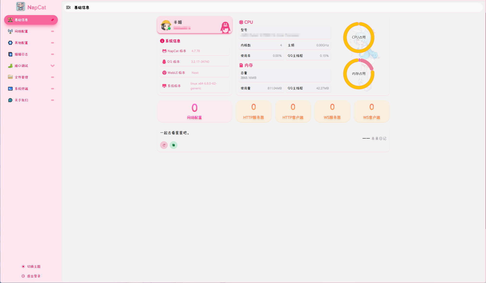

## 配置NapCat
* 登录NapCat后,选择网络配置
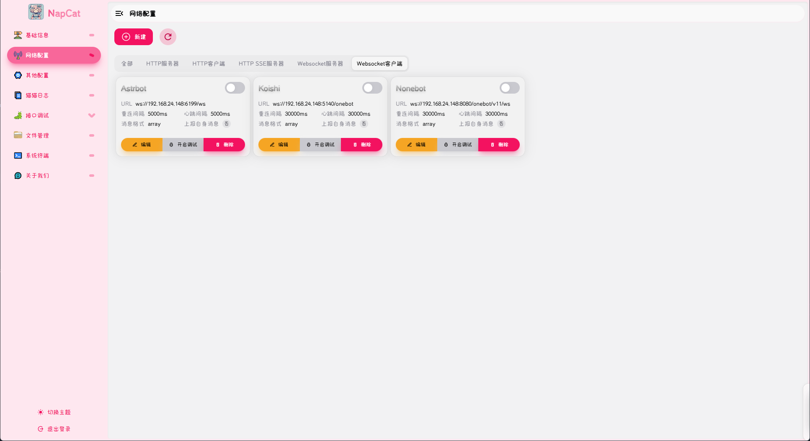

* 选择新建,新建WebSocket客户端,新增三个配置(后两个可之后再添加,目前只使用AstrBot)
    AstrBot:
    ```
    ws://宿主机IP:6199/ws
    ```
    Koishi:
    ```
    ws://宿主机IP:5140/onebot
    ```
    Nonebot:
    ```
    ws://宿主机IP:8080/onebot/v11/ws
    ```

# AstrBot
我最早是从nonebot1代用过来的人,现在转向AstrBot最大的一个原因是它[搬史插件](https://github.com/anka-afk/astrbot_sowing_discord),当然其他Bot框架也可以通过写插件来转发这个项目,AstrBot的活跃度非常高,Bot框架互相可以不冲突,就直接部署上来了.

## 安装AstrBot
+ Bot框架个人一般不使用docker安装,docker相比直接部署起来修改起来比较麻烦.
    - docker安装:
        ```
        sudo docker run -itd -p 6180-6200:6180-6200 \
         -p 11451:11451 \
         -v your_path:/AstrBot/data \
         -v /etc/localtime:/etc/localtime:ro \
         -v /etc/timezone:/etc/timezone:ro \
         --name astrbot \
         --restart=always \
         soulter/astrbot:latest
        ```
        持久化数据路径: /AstrBot/data
    
    - 手动部署:
        * (可选,推荐)安装uv,使用你喜欢的下载器.
            ```
            curl -LsSf https://astral.sh/uv/install.sh | sh
            ```
            or
            ```
            wget -qO- https://astral.sh/uv/install.sh | sh
            ```
        * 下载AstrBot项目
            ```
            git clone http://github.com/Soulter/AstrBot
            cd AstrBot
            ```
            如果你没有安装 git，请先下载安装.
        * 安装依赖并运行
            * 使用uv
                ```
                uv sync
                uv run main.py
                ```
            * 如果不使用uv,创建一个Python虚拟环境来安装依赖项.
                ```
                python3 -m venv ./venv
                # 也可能是 python 而不是 python3,视你的系统环境而定.
                ```
                ```
                source venv/bin/activate
                python -m pip install -r requirements.txt -i https://mirrors.tuna.tsinghua.edu.cn/pypi/web/simple
                python main.py
                ```

## 配置AstrBot
* 登录AstrBot的Web控制台.
    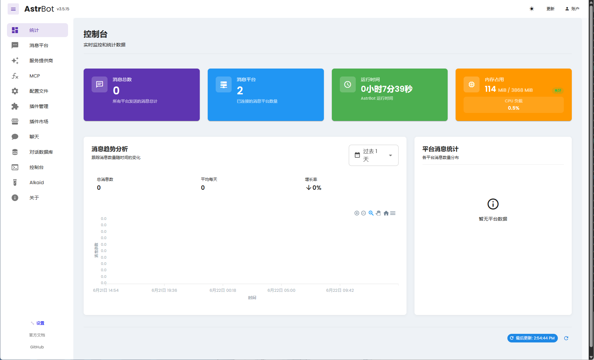

* 点击消息平台,点击右边新增适配器,选择aiocqhttp(OneBotv11).
    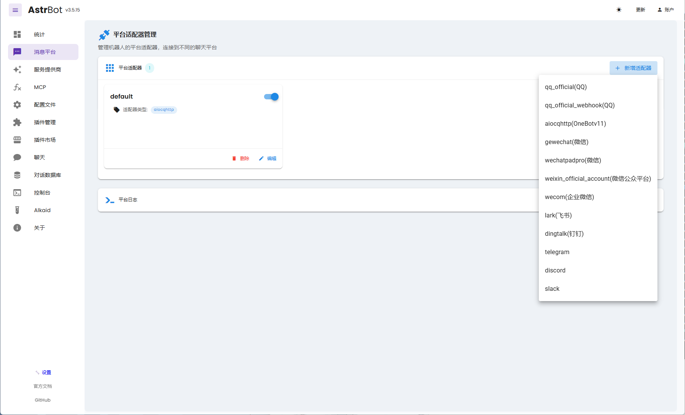

* 保持默认,选择保存.
    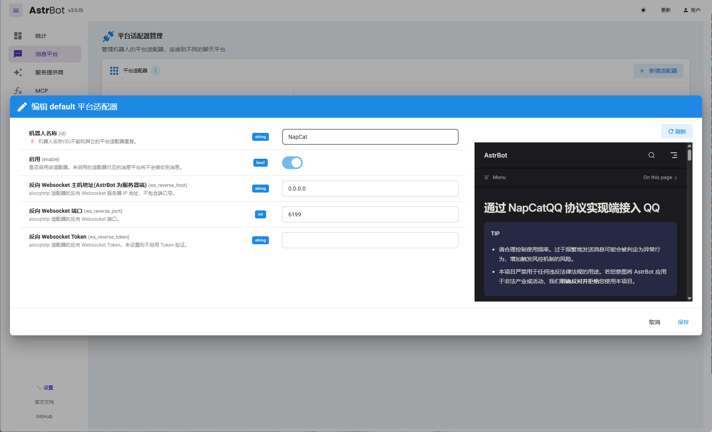

* 展开平台日志,对登录的QQ发起消息,若在日志中看到你发的消息则表示部署成功了.
    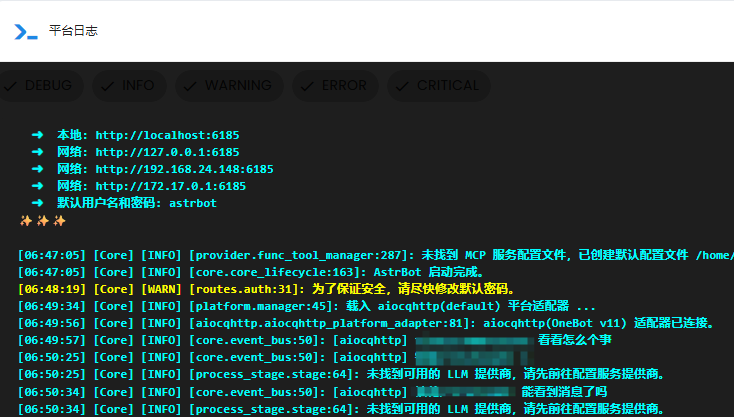


# 配置第一个免费的模型
[讯飞星火](https://xinghuo.xfyun.cn/)是当前不多的可以有免费tokens的模型.
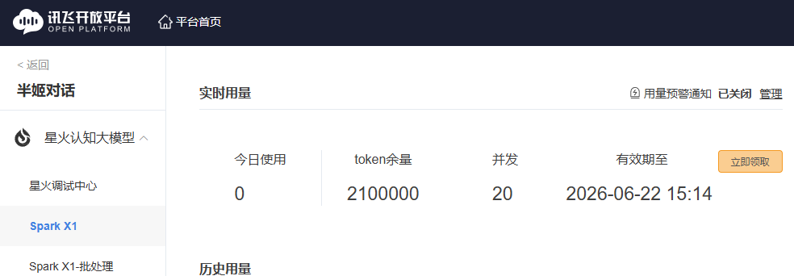

* 登录AstrBot的Web控制台.
* 选择服务提供商,右边点击新增服务供应商.
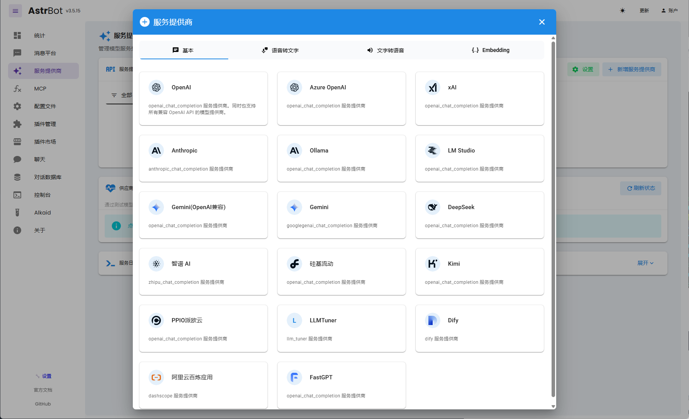

* 选择OpenAI,从[星火控制台](https://console.xfyun.cn/services/bmx1)及[星火文档](https://www.xfyun.cn/doc/spark/X1http.html)获得链接地址以及APIPassword,填入API Base URL (api_base)及API Key (key),模型名称填x1,保存.
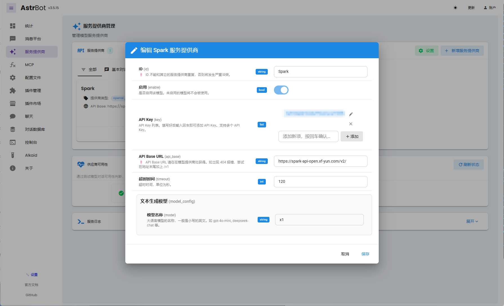

* 在供应商可用性右边点击**刷新状态**,等待出现可用.
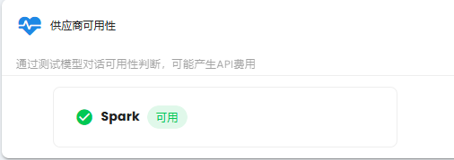

* 此时,对机器人qq发送消息,则会使用模型回复消息.


* 在AstrBot的Web控制台选择配置文件,则可以对使用模型进行详细的调整.
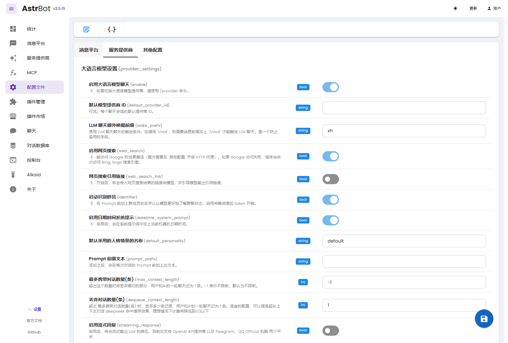